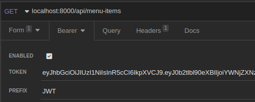

# Description
This is the final assignment for the Bakend Developer Capstone Course of the Meta Backend Developer Professional Certificate on Coursera.
<br> <br>

# Project Structure
The project is composed of two apps, `api` and `restaurant`. The `api` app serves API endpoints of the project, while the `restaurant` app serves its frontend. The `config` (the project folder) directory holds the major settings of the project
<br> <br>

# Installation

install the dependencies
```jsx
pipenv install
```

Activate the virtual environment

```jsx
pipenv shell
```
<br>

# Setup
The default database settings are

```jsx
DATABASES = {
    'default': {
        'ENGINE': 'django.db.backends.mysql',
        'NAME': 'littlelemon',
        'HOST': 'localhost',
        'PORT': '3306',
        'USER': 'admin',
        'PASSWORD': '',
        'OPTIONS': {
            'init_command': "SET sql_mode='STRICT_TRANS_TABLES'",
        },
    },
}
```
💡 Change those settings according to your local setup.
<br>
<br>

Apply the migrations
```jsx
python manage.py migrate
```
<br>

# Environment Variables
For authenticated API requests in the view of the restaurant app, a username and password must be provided. Follow the instructions bellow <br>

Inside the restaurant app folder, create a file called .env and place the code inside it
```jsx
USERNAME=yout_username
PASSWORD=your_password
```
<aside>💡 replace "your_username" and "your_password" with a valid username and password respectively</aside>

<aside>💡 Be aware that `django-environ` must be installed for this to work. Such dependency should be installed by running `pipenv install`</aside>
<br> <br>

# API Endpoints
The `api` app has a total of 4 endpoints. Additionally, `Djoser` and `SimpleJWT` endpoints are available.
<br>

Each endpoint requires a SimpleJWT Token for authorization. Pass the token in the header of the request such as
```jsx
{'Authorization': 'JWT <token>'}
```
<br>

In Insomnia, add the token as follows


<br>

### Endpoints for `api` app
```jsx
http:127.0.0.1:8000/api/menu-items
http:127.0.0.1:8000/api/menu-items/{menu-itemId}
http:127.0.0.1:8000/api/bookings
http:127.0.0.1:8000/api/bookings/{bookingId}
```
<br>

http:127.0.0.1:8000/api/menu-items
| Method | Action | TOKEN AUTH | STATUS CODE |
| --- | --- | --- | --- |
| GET | Retrieves all menu items | Yes | 200 |
| POST | Creates a menu item | Yes | 201 |
<br>

http:127.0.0.1:8000/api/menu-items/{menu-itemId}
| Method | Action | TOKEN AUTH | STATUS CODE |
| --- | --- | --- | --- |
| GET | Retrieves the menu item details | Yes | 200 |
| PUT | Update the menu item | Yes | 200 |
| PATCH | Partially update the menu item | Yes | 200 |
| DELETE | Delete the menu item | Yes | 200 |
<br>

http:127.0.0.1:8000/api/bookings
| Method | Action | TOKEN AUTH | STATUS CODE |
| --- | --- | --- | --- |
| GET | Retrieves all bookings | Yes | 200 |
| POST | Creates a booking | Yes | 201 |
<br>

http:127.0.0.1:8000/api/bookings/{bookingId}
| Method | Action | TOKEN AUTH | STATUS CODE |
| --- | --- | --- | --- |
| GET | Retrieves the booking details | Yes | 200 |
| PUT | Update the booking | Yes | 200 |
| PATCH | Partially update the booking | Yes | 200 |
| DELETE | Delete the booking | Yes | 200 |
<br>

### Endpoints for `djoser` app
```jsx
http://127.0.0.1:8000/auth/users/
http://127.0.0.1:8000/auth/users/me/
http://127.0.0.1:8000/auth/users/confirm/
http://127.0.0.1:8000/auth/users/resend_activation/
http://127.0.0.1:8000/auth/users/set_password/
http://127.0.0.1:8000/auth/users/reset_password/
http://127.0.0.1:8000/auth/users/reset_password_confirm/
http://127.0.0.1:8000/auth/users/set_username/
http://127.0.0.1:8000/auth/users/reset_username/
http://127.0.0.1:8000/auth/users/reset_username_confirm/
```
<br>

http://127.0.0.1:8000/auth/users/
| Method | Action | STATUS CODE | TOKEN AUTH |
| --- | --- | --- | --- |
| GET | Retrieves all users | 200 | No |
| POST | Creates a user | 201 | No |

💡 Please refer to the [Djoser documentation](https://djoser.readthedocs.io/en/latest/getting_started.html#available-endpoints) for further usage on these endpoints.
<br> <br>

### Endpoints for `simplejwt` app
```jsx
http:127.0.0.1:8000/api/token/login/
http:127.0.0.1:8000/api/token/refresh/
```
<br>

http://127.0.0.1:8000/api/token/login/
| Method | Action | TOKEN AUTH | STATUS CODE |
| --- | --- | --- | --- |
| POST | Generates access token and refresh token | Yes | 201 |
<br>

http://127.0.0.1:8000/api/token/refresh/
| Method | Action | TOKEN AUTH | STATUS CODE |
| --- | --- | --- | --- |
| POST | Generates a new access token | Yes | 201 |
<br>

# Testing
There are a total of 12 tests to ensure that each API endpoint and each of its allowed HTTP methods work properly.
<br>

Run the tests
```jsx
python manage.py test
```
<br>

It should output something similar to this
```jsx
Found 12 test(s).
Creating test database for alias 'default'...
System check identified no issues (0 silenced).
............
----------------------------------------------------------------------
Ran 12 tests in 6.024s

OK
Destroying test database for alias 'default'...
```
<br>

<aside>💡 These tests intrinsically test the `restaurant` models by creating entries on its database through the Django ORM.</aside>
